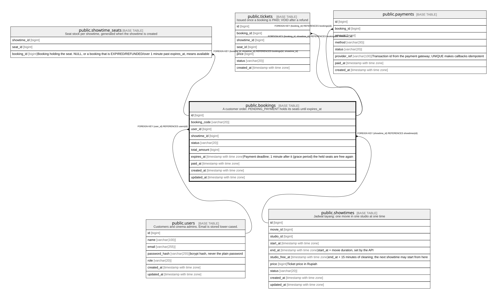

# public.bookings

## Description

A customer order. PENDING_PAYMENT holds its seats until expires_at

## Columns

| Name | Type | Default | Nullable | Children | Parents | Comment |
| ---- | ---- | ------- | -------- | -------- | ------- | ------- |
| id | bigint |  | false | [public.showtime_seats](public.showtime_seats.md) [public.tickets](public.tickets.md) [public.payments](public.payments.md) |  |  |
| booking_code | varchar(20) |  | false |  |  |  |
| user_id | bigint |  | false |  | [public.users](public.users.md) |  |
| showtime_id | bigint |  | false | [public.showtime_seats](public.showtime_seats.md) [public.tickets](public.tickets.md) | [public.showtimes](public.showtimes.md) |  |
| status | varchar(20) | 'PENDING_PAYMENT'::character varying | false |  |  |  |
| total_amount | bigint |  | false |  |  |  |
| expires_at | timestamp with time zone |  | false |  |  | Payment deadline; 1 minute after it (grace period) the held seats are free again |
| paid_at | timestamp with time zone |  | true |  |  |  |
| created_at | timestamp with time zone | now() | false |  |  |  |
| updated_at | timestamp with time zone | now() | false |  |  |  |

## Constraints

| Name | Type | Definition |
| ---- | ---- | ---------- |
| bookings_check | CHECK | CHECK (((((status)::text = 'PAID'::text) = (paid_at IS NOT NULL)) OR ((status)::text = 'REFUNDED'::text))) |
| bookings_status_check | CHECK | CHECK (((status)::text = ANY ((ARRAY['PENDING_PAYMENT'::character varying, 'PAID'::character varying, 'EXPIRED'::character varying, 'REFUNDED'::character varying])::text[]))) |
| bookings_total_amount_check | CHECK | CHECK ((total_amount >= 0)) |
| bookings_user_id_fkey | FOREIGN KEY | FOREIGN KEY (user_id) REFERENCES users(id) |
| bookings_showtime_id_fkey | FOREIGN KEY | FOREIGN KEY (showtime_id) REFERENCES showtimes(id) |
| bookings_pkey | PRIMARY KEY | PRIMARY KEY (id) |
| bookings_booking_code_key | UNIQUE | UNIQUE (booking_code) |
| bookings_id_showtime_id_key | UNIQUE | UNIQUE (id, showtime_id) |

## Indexes

| Name | Definition |
| ---- | ---------- |
| bookings_pkey | CREATE UNIQUE INDEX bookings_pkey ON public.bookings USING btree (id) |
| bookings_booking_code_key | CREATE UNIQUE INDEX bookings_booking_code_key ON public.bookings USING btree (booking_code) |
| bookings_id_showtime_id_key | CREATE UNIQUE INDEX bookings_id_showtime_id_key ON public.bookings USING btree (id, showtime_id) |
| bookings_user_id_idx | CREATE INDEX bookings_user_id_idx ON public.bookings USING btree (user_id) |
| bookings_showtime_id_idx | CREATE INDEX bookings_showtime_id_idx ON public.bookings USING btree (showtime_id) |

## Relations

---

> Generated by [tbls](https://github.com/k1LoW/tbls)
