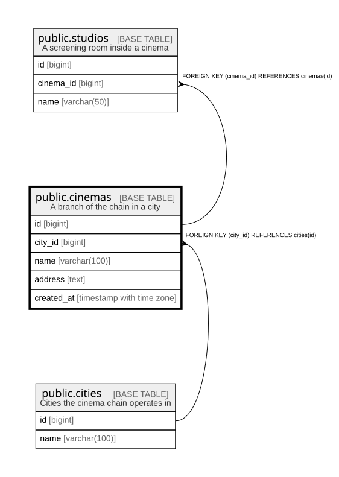

# public.cinemas

## Description

A branch of the chain in a city

## Columns

| Name | Type | Default | Nullable | Children | Parents | Comment |
| ---- | ---- | ------- | -------- | -------- | ------- | ------- |
| id | bigint |  | false | [public.studios](public.studios.md) |  |  |
| city_id | bigint |  | false |  | [public.cities](public.cities.md) |  |
| name | varchar(100) |  | false |  |  |  |
| address | text |  | false |  |  |  |
| created_at | timestamp with time zone | now() | false |  |  |  |

## Constraints

| Name | Type | Definition |
| ---- | ---- | ---------- |
| cinemas_city_id_fkey | FOREIGN KEY | FOREIGN KEY (city_id) REFERENCES cities(id) |
| cinemas_pkey | PRIMARY KEY | PRIMARY KEY (id) |
| cinemas_city_id_name_key | UNIQUE | UNIQUE (city_id, name) |

## Indexes

| Name | Definition |
| ---- | ---------- |
| cinemas_pkey | CREATE UNIQUE INDEX cinemas_pkey ON public.cinemas USING btree (id) |
| cinemas_city_id_name_key | CREATE UNIQUE INDEX cinemas_city_id_name_key ON public.cinemas USING btree (city_id, name) |

## Relations

---

> Generated by [tbls](https://github.com/k1LoW/tbls)
