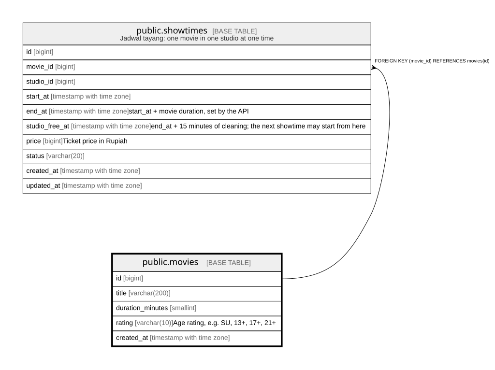

# public.movies

## Columns

| Name | Type | Default | Nullable | Children | Parents | Comment |
| ---- | ---- | ------- | -------- | -------- | ------- | ------- |
| id | bigint |  | false | [public.showtimes](public.showtimes.md) |  |  |
| title | varchar(200) |  | false |  |  |  |
| duration_minutes | smallint |  | false |  |  |  |
| rating | varchar(10) |  | false |  |  | Age rating, e.g. SU, 13+, 17+, 21+ |
| created_at | timestamp with time zone | now() | false |  |  |  |

## Constraints

| Name | Type | Definition |
| ---- | ---- | ---------- |
| movies_duration_minutes_check | CHECK | CHECK ((duration_minutes > 0)) |
| movies_pkey | PRIMARY KEY | PRIMARY KEY (id) |

## Indexes

| Name | Definition |
| ---- | ---------- |
| movies_pkey | CREATE UNIQUE INDEX movies_pkey ON public.movies USING btree (id) |

## Relations

---

> Generated by [tbls](https://github.com/k1LoW/tbls)
