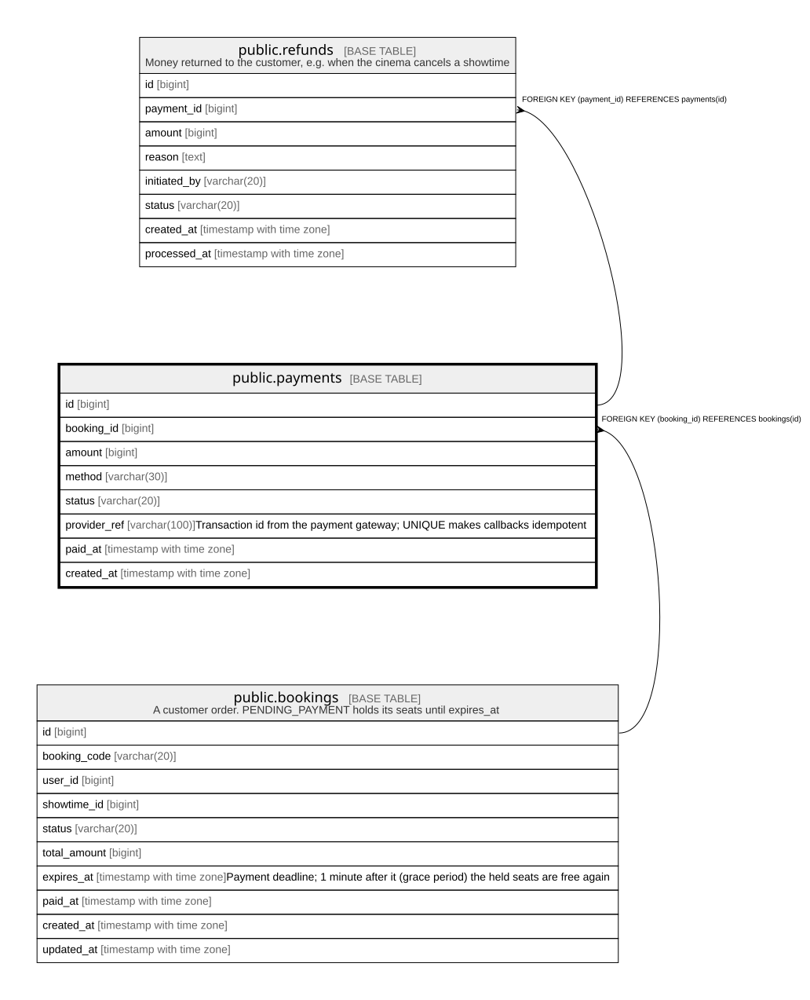

# public.payments

## Columns

| Name | Type | Default | Nullable | Children | Parents | Comment |
| ---- | ---- | ------- | -------- | -------- | ------- | ------- |
| id | bigint |  | false | [public.refunds](public.refunds.md) |  |  |
| booking_id | bigint |  | false |  | [public.bookings](public.bookings.md) |  |
| amount | bigint |  | false |  |  |  |
| method | varchar(30) |  | false |  |  |  |
| status | varchar(20) | 'PENDING'::character varying | false |  |  |  |
| provider_ref | varchar(100) |  | true |  |  | Transaction id from the payment gateway; UNIQUE makes callbacks idempotent |
| paid_at | timestamp with time zone |  | true |  |  |  |
| created_at | timestamp with time zone | now() | false |  |  |  |

## Constraints

| Name | Type | Definition |
| ---- | ---- | ---------- |
| payments_amount_check | CHECK | CHECK ((amount > 0)) |
| payments_status_check | CHECK | CHECK (((status)::text = ANY ((ARRAY['PENDING'::character varying, 'SUCCESS'::character varying, 'FAILED'::character varying])::text[]))) |
| payments_booking_id_fkey | FOREIGN KEY | FOREIGN KEY (booking_id) REFERENCES bookings(id) |
| payments_pkey | PRIMARY KEY | PRIMARY KEY (id) |
| payments_provider_ref_key | UNIQUE | UNIQUE (provider_ref) |

## Indexes

| Name | Definition |
| ---- | ---------- |
| payments_pkey | CREATE UNIQUE INDEX payments_pkey ON public.payments USING btree (id) |
| payments_provider_ref_key | CREATE UNIQUE INDEX payments_provider_ref_key ON public.payments USING btree (provider_ref) |
| payments_booking_id_idx | CREATE INDEX payments_booking_id_idx ON public.payments USING btree (booking_id) |

## Relations

---

> Generated by [tbls](https://github.com/k1LoW/tbls)
