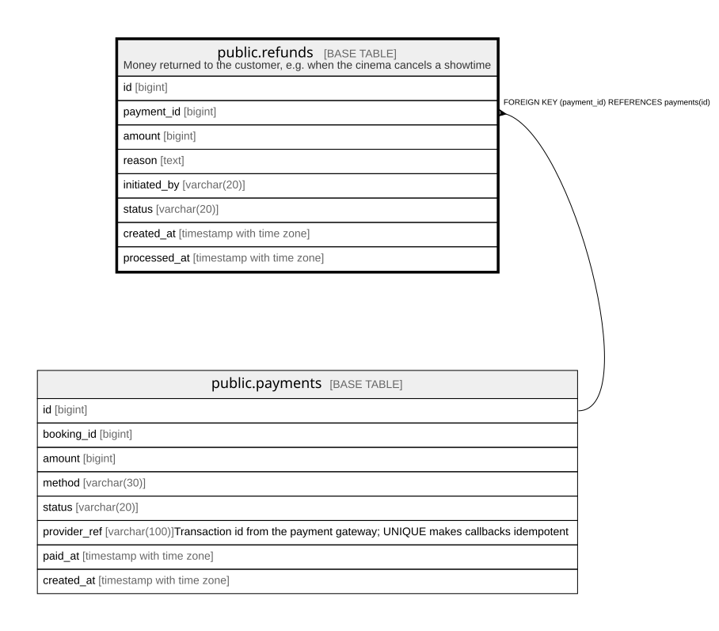

# public.refunds

## Description

Money returned to the customer, e.g. when the cinema cancels a showtime

## Columns

| Name | Type | Default | Nullable | Children | Parents | Comment |
| ---- | ---- | ------- | -------- | -------- | ------- | ------- |
| id | bigint |  | false |  |  |  |
| payment_id | bigint |  | false |  | [public.payments](public.payments.md) |  |
| amount | bigint |  | false |  |  |  |
| reason | text |  | false |  |  |  |
| initiated_by | varchar(20) |  | false |  |  |  |
| status | varchar(20) | 'PENDING'::character varying | false |  |  |  |
| created_at | timestamp with time zone | now() | false |  |  |  |
| processed_at | timestamp with time zone |  | true |  |  |  |

## Constraints

| Name | Type | Definition |
| ---- | ---- | ---------- |
| refunds_amount_check | CHECK | CHECK ((amount > 0)) |
| refunds_initiated_by_check | CHECK | CHECK (((initiated_by)::text = ANY ((ARRAY['customer'::character varying, 'cinema'::character varying])::text[]))) |
| refunds_status_check | CHECK | CHECK (((status)::text = ANY ((ARRAY['PENDING'::character varying, 'SUCCESS'::character varying, 'FAILED'::character varying])::text[]))) |
| refunds_payment_id_fkey | FOREIGN KEY | FOREIGN KEY (payment_id) REFERENCES payments(id) |
| refunds_pkey | PRIMARY KEY | PRIMARY KEY (id) |

## Indexes

| Name | Definition |
| ---- | ---------- |
| refunds_pkey | CREATE UNIQUE INDEX refunds_pkey ON public.refunds USING btree (id) |
| refunds_payment_id_idx | CREATE INDEX refunds_payment_id_idx ON public.refunds USING btree (payment_id) |

## Relations

---

> Generated by [tbls](https://github.com/k1LoW/tbls)
