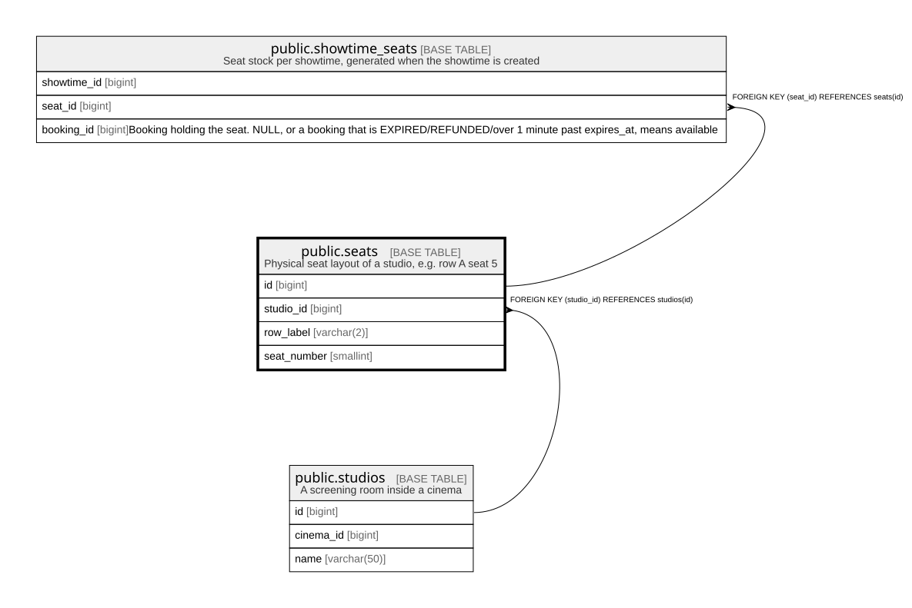

# public.seats

## Description

Physical seat layout of a studio, e.g. row A seat 5

## Columns

| Name | Type | Default | Nullable | Children | Parents | Comment |
| ---- | ---- | ------- | -------- | -------- | ------- | ------- |
| id | bigint |  | false | [public.showtime_seats](public.showtime_seats.md) |  |  |
| studio_id | bigint |  | false |  | [public.studios](public.studios.md) |  |
| row_label | varchar(2) |  | false |  |  |  |
| seat_number | smallint |  | false |  |  |  |

## Constraints

| Name | Type | Definition |
| ---- | ---- | ---------- |
| seats_seat_number_check | CHECK | CHECK ((seat_number > 0)) |
| seats_studio_id_fkey | FOREIGN KEY | FOREIGN KEY (studio_id) REFERENCES studios(id) |
| seats_pkey | PRIMARY KEY | PRIMARY KEY (id) |
| seats_studio_id_row_label_seat_number_key | UNIQUE | UNIQUE (studio_id, row_label, seat_number) |

## Indexes

| Name | Definition |
| ---- | ---------- |
| seats_pkey | CREATE UNIQUE INDEX seats_pkey ON public.seats USING btree (id) |
| seats_studio_id_row_label_seat_number_key | CREATE UNIQUE INDEX seats_studio_id_row_label_seat_number_key ON public.seats USING btree (studio_id, row_label, seat_number) |

## Relations

---

> Generated by [tbls](https://github.com/k1LoW/tbls)
