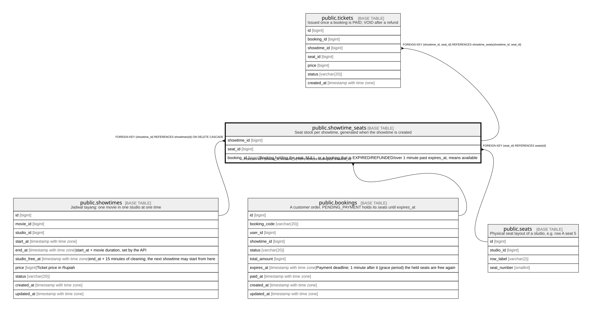

# public.showtime_seats

## Description

Seat stock per showtime, generated when the showtime is created

## Columns

| Name | Type | Default | Nullable | Children | Parents | Comment |
| ---- | ---- | ------- | -------- | -------- | ------- | ------- |
| showtime_id | bigint |  | false | [public.tickets](public.tickets.md) | [public.showtimes](public.showtimes.md) [public.bookings](public.bookings.md) |  |
| seat_id | bigint |  | false | [public.tickets](public.tickets.md) | [public.seats](public.seats.md) |  |
| booking_id | bigint |  | true |  | [public.bookings](public.bookings.md) | Booking holding the seat. NULL, or a booking that is EXPIRED/REFUNDED/over 1 minute past expires_at, means available |

## Constraints

| Name | Type | Definition |
| ---- | ---- | ---------- |
| showtime_seats_seat_id_fkey | FOREIGN KEY | FOREIGN KEY (seat_id) REFERENCES seats(id) |
| showtime_seats_showtime_id_fkey | FOREIGN KEY | FOREIGN KEY (showtime_id) REFERENCES showtimes(id) ON DELETE CASCADE |
| showtime_seats_booking_id_showtime_id_fkey | FOREIGN KEY | FOREIGN KEY (booking_id, showtime_id) REFERENCES bookings(id, showtime_id) |
| showtime_seats_pkey | PRIMARY KEY | PRIMARY KEY (showtime_id, seat_id) |

## Indexes

| Name | Definition |
| ---- | ---------- |
| showtime_seats_pkey | CREATE UNIQUE INDEX showtime_seats_pkey ON public.showtime_seats USING btree (showtime_id, seat_id) |
| showtime_seats_booking_id_idx | CREATE INDEX showtime_seats_booking_id_idx ON public.showtime_seats USING btree (booking_id) |

## Relations

---

> Generated by [tbls](https://github.com/k1LoW/tbls)
