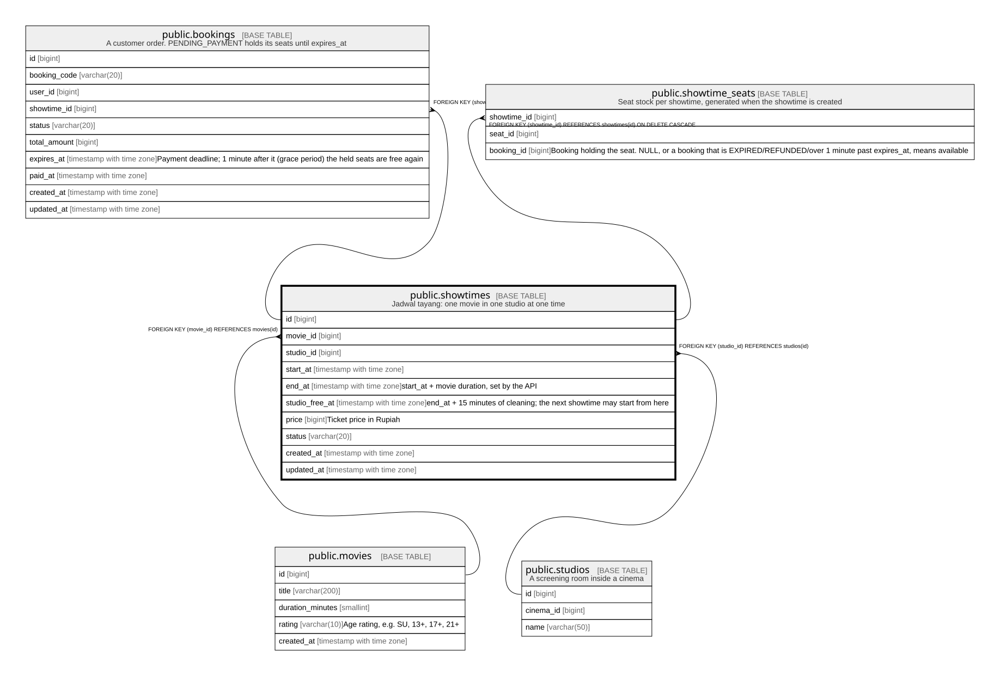

# public.showtimes

## Description

Jadwal tayang: one movie in one studio at one time

## Columns

| Name | Type | Default | Nullable | Children | Parents | Comment |
| ---- | ---- | ------- | -------- | -------- | ------- | ------- |
| id | bigint |  | false | [public.bookings](public.bookings.md) [public.showtime_seats](public.showtime_seats.md) |  |  |
| movie_id | bigint |  | false |  | [public.movies](public.movies.md) |  |
| studio_id | bigint |  | false |  | [public.studios](public.studios.md) |  |
| start_at | timestamp with time zone |  | false |  |  |  |
| end_at | timestamp with time zone |  | false |  |  | start_at + movie duration, set by the API |
| studio_free_at | timestamp with time zone |  | false |  |  | end_at + 15 minutes of cleaning; the next showtime may start from here |
| price | bigint |  | false |  |  | Ticket price in Rupiah |
| status | varchar(20) | 'SCHEDULED'::character varying | false |  |  |  |
| created_at | timestamp with time zone | now() | false |  |  |  |
| updated_at | timestamp with time zone | now() | false |  |  |  |

## Constraints

| Name | Type | Definition |
| ---- | ---- | ---------- |
| showtimes_check | CHECK | CHECK ((end_at > start_at)) |
| showtimes_check1 | CHECK | CHECK ((studio_free_at >= end_at)) |
| showtimes_price_check | CHECK | CHECK ((price > 0)) |
| showtimes_status_check | CHECK | CHECK (((status)::text = ANY ((ARRAY['SCHEDULED'::character varying, 'CANCELLED'::character varying])::text[]))) |
| showtimes_studio_id_fkey | FOREIGN KEY | FOREIGN KEY (studio_id) REFERENCES studios(id) |
| showtimes_movie_id_fkey | FOREIGN KEY | FOREIGN KEY (movie_id) REFERENCES movies(id) |
| showtimes_pkey | PRIMARY KEY | PRIMARY KEY (id) |
| showtimes_no_overlap | x | EXCLUDE USING gist (studio_id WITH =, tstzrange(start_at, studio_free_at) WITH &&) WHERE (((status)::text = 'SCHEDULED'::text)) |

## Indexes

| Name | Definition |
| ---- | ---------- |
| showtimes_pkey | CREATE UNIQUE INDEX showtimes_pkey ON public.showtimes USING btree (id) |
| showtimes_no_overlap | CREATE INDEX showtimes_no_overlap ON public.showtimes USING gist (studio_id, tstzrange(start_at, studio_free_at)) WHERE ((status)::text = 'SCHEDULED'::text) |
| showtimes_movie_id_idx | CREATE INDEX showtimes_movie_id_idx ON public.showtimes USING btree (movie_id) |
| showtimes_start_at_idx | CREATE INDEX showtimes_start_at_idx ON public.showtimes USING btree (start_at) |

## Relations

---

> Generated by [tbls](https://github.com/k1LoW/tbls)
