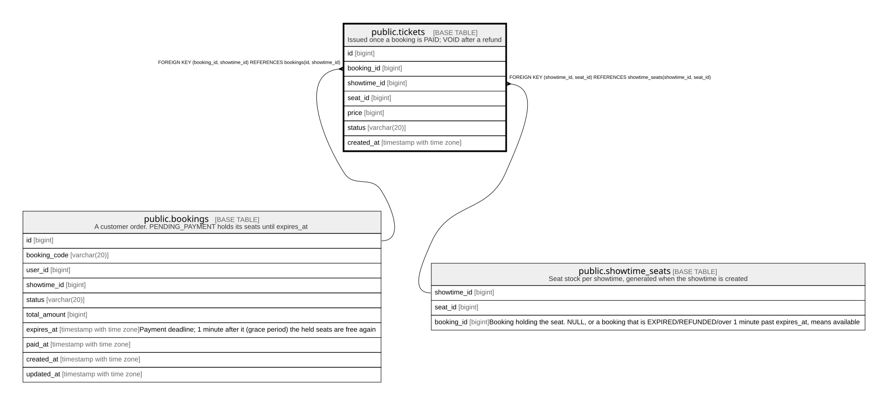

# public.tickets

## Description

Issued once a booking is PAID; VOID after a refund

## Columns

| Name | Type | Default | Nullable | Children | Parents | Comment |
| ---- | ---- | ------- | -------- | -------- | ------- | ------- |
| id | bigint |  | false |  |  |  |
| booking_id | bigint |  | false |  | [public.bookings](public.bookings.md) |  |
| showtime_id | bigint |  | false |  | [public.bookings](public.bookings.md) [public.showtime_seats](public.showtime_seats.md) |  |
| seat_id | bigint |  | false |  | [public.showtime_seats](public.showtime_seats.md) |  |
| price | bigint |  | false |  |  |  |
| status | varchar(20) | 'ACTIVE'::character varying | false |  |  |  |
| created_at | timestamp with time zone | now() | false |  |  |  |

## Constraints

| Name | Type | Definition |
| ---- | ---- | ---------- |
| tickets_price_check | CHECK | CHECK ((price >= 0)) |
| tickets_status_check | CHECK | CHECK (((status)::text = ANY ((ARRAY['ACTIVE'::character varying, 'VOID'::character varying])::text[]))) |
| tickets_booking_id_showtime_id_fkey | FOREIGN KEY | FOREIGN KEY (booking_id, showtime_id) REFERENCES bookings(id, showtime_id) |
| tickets_showtime_id_seat_id_fkey | FOREIGN KEY | FOREIGN KEY (showtime_id, seat_id) REFERENCES showtime_seats(showtime_id, seat_id) |
| tickets_pkey | PRIMARY KEY | PRIMARY KEY (id) |

## Indexes

| Name | Definition |
| ---- | ---------- |
| tickets_pkey | CREATE UNIQUE INDEX tickets_pkey ON public.tickets USING btree (id) |
| tickets_one_active_per_seat | CREATE UNIQUE INDEX tickets_one_active_per_seat ON public.tickets USING btree (showtime_id, seat_id) WHERE ((status)::text = 'ACTIVE'::text) |
| tickets_booking_id_idx | CREATE INDEX tickets_booking_id_idx ON public.tickets USING btree (booking_id) |

## Relations

---

> Generated by [tbls](https://github.com/k1LoW/tbls)
