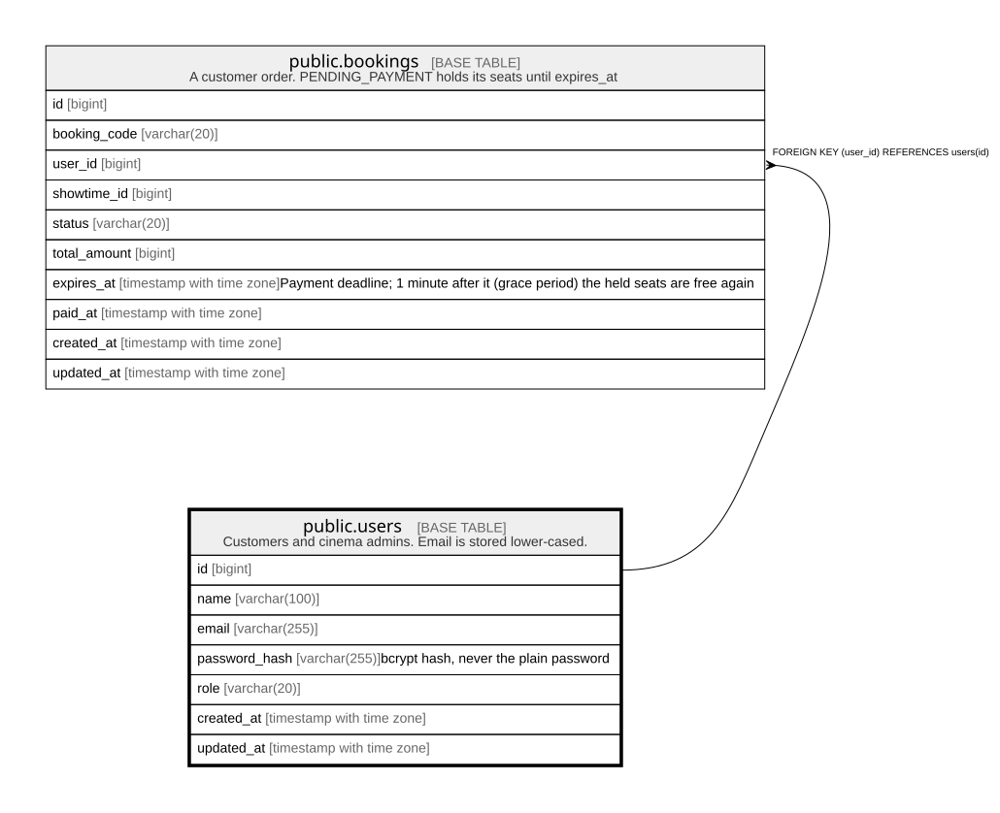

# public.users

## Description

Customers and cinema admins. Email is stored lower-cased.

## Columns

| Name | Type | Default | Nullable | Children | Parents | Comment |
| ---- | ---- | ------- | -------- | -------- | ------- | ------- |
| id | bigint |  | false | [public.bookings](public.bookings.md) |  |  |
| name | varchar(100) |  | false |  |  |  |
| email | varchar(255) |  | false |  |  |  |
| password_hash | varchar(255) |  | false |  |  | bcrypt hash, never the plain password |
| role | varchar(20) | 'customer'::character varying | false |  |  |  |
| created_at | timestamp with time zone | now() | false |  |  |  |
| updated_at | timestamp with time zone | now() | false |  |  |  |

## Constraints

| Name | Type | Definition |
| ---- | ---- | ---------- |
| users_email_check | CHECK | CHECK (((email)::text = lower((email)::text))) |
| users_role_check | CHECK | CHECK (((role)::text = ANY ((ARRAY['admin'::character varying, 'customer'::character varying])::text[]))) |
| users_pkey | PRIMARY KEY | PRIMARY KEY (id) |
| users_email_key | UNIQUE | UNIQUE (email) |

## Indexes

| Name | Definition |
| ---- | ---------- |
| users_pkey | CREATE UNIQUE INDEX users_pkey ON public.users USING btree (id) |
| users_email_key | CREATE UNIQUE INDEX users_email_key ON public.users USING btree (email) |

## Relations

---

> Generated by [tbls](https://github.com/k1LoW/tbls)
