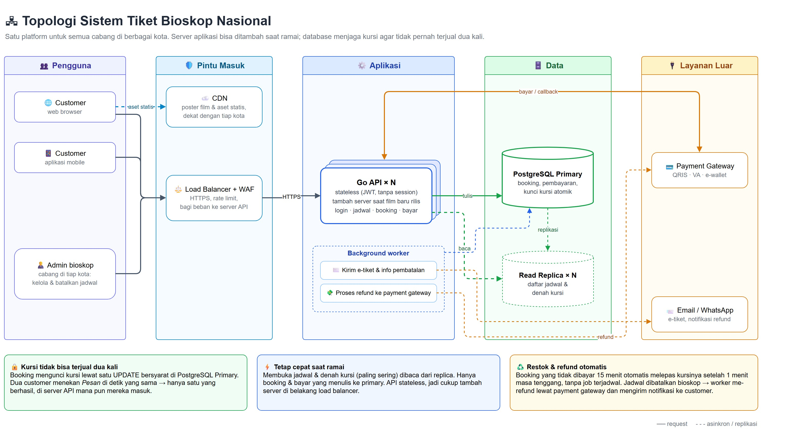
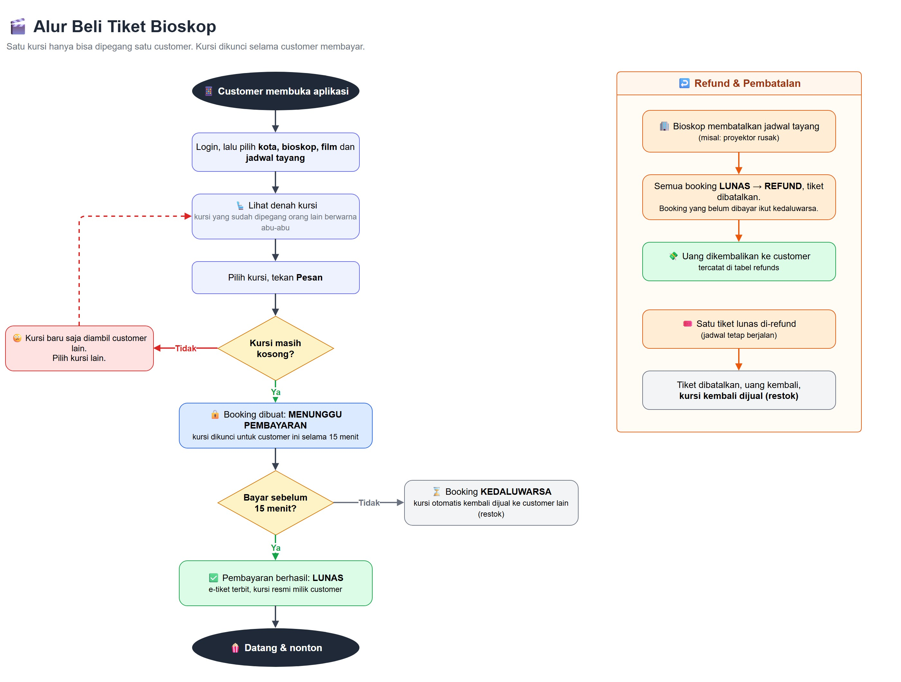

# System Design — Pembelian Tiket Bioskop

## Topologi



## Flowchart (untuk orang awam)



Sumber diagram: [`topology.drawio`](topology.drawio), [`flowchart.drawio`](flowchart.drawio) (buka di [draw.io](https://app.diagrams.net)). ERD: [`erd.jpg`](erd.jpg); detail kolom dan constraint ada di [`db/schema.sql`](../db/schema.sql).

## 1. Pemilihan kursi (aman dari rebutan & tetap cepat)

**Stok kursi per jadwal.** Saat admin membuat jadwal tayang, semua kursi studio disalin ke `showtime_seats` (satu baris per kursi per jadwal). Baris inilah yang diperebutkan customer.

**Booking = kunci kursi dalam satu transaksi.** Booking dibuat dengan status `PENDING_PAYMENT` dan `expires_at = now() + 15 menit`, lalu kursinya dikunci dengan satu `UPDATE` bersyarat:

```sql
UPDATE showtime_seats s SET booking_id = $booking
WHERE s.showtime_id = $showtime AND s.seat_id = ANY($seats)
  AND (s.booking_id IS NULL OR EXISTS (
        SELECT 1 FROM bookings b WHERE b.id = s.booking_id
          AND (b.status IN ('EXPIRED', 'REFUNDED')
               OR (b.status = 'PENDING_PAYMENT' AND b.expires_at < now() - interval '1 minute'))));
-- jumlah baris ter-update != jumlah kursi diminta  →  ROLLBACK, "kursi sudah diambil"
```

**Masa tenggang 1 menit.** Pembayaran diterima sampai `expires_at`, tetapi kursinya baru boleh diambil orang lain setelah `expires_at + 1 menit`. Tanpa jeda ini, callback pembayaran yang mulai sesaat sebelum batas waktu dan customer lain yang mengambil kursi sesaat sesudahnya bisa sama-sama merasa berhasil, karena `now()` di Postgres adalah waktu *awal* transaksi dan status `PAID` yang belum di-commit belum terlihat oleh transaksi lain. Satu menit jauh lebih panjang dari transaksi mana pun, jadi dua jendela waktu itu tidak pernah tumpang tindih.

- Postgres mengunci baris yang di-update, jadi dua transaksi yang merebut kursi sama tidak bisa sama-sama menang. Yang kedua menunggu, lalu kondisi `WHERE` dievaluasi ulang dan gagal.
- Kunci hanya dipegang selama transaksi (milidetik), **bukan** selama customer berpikir atau membayar. Jadi tidak ada `SELECT ... FOR UPDATE` panjang yang memblokir customer lain.
- Pengaman terakhir: `UNIQUE (showtime_id, seat_id) WHERE status = 'ACTIVE'` di `tickets`, jadi satu kursi mustahil punya dua tiket aktif, bahkan kalau ada bug di aplikasi.
- Foreign key komposit `(booking_id, showtime_id)` di `showtime_seats` dan `tickets`: kursi atau tiket hanya bisa merujuk booking dari jadwal yang sama.

Sudah diuji ke Postgres asli: 20 transaksi bersamaan merebut 1 kursi, hanya **1** yang berhasil.

**Performa untuk banyak pengguna** (lihat topologi):
- API Go stateless (JWT, tanpa session), jadi bisa ditambah server di belakang load balancer.
- Daftar jadwal & denah kursi dibaca dari read replica. Hanya booking/bayar yang menulis ke primary.
- Kunci per baris kursi: customer yang memilih kursi berbeda tidak saling menunggu.

## 2. Pencatatan & restok tiket

| Tabel | Mencatat |
|---|---|
| `bookings` | pesanan + status: `PENDING_PAYMENT` → `PAID` / `EXPIRED` → `REFUNDED` |
| `showtime_seats` | kursi mana dipegang booking mana |
| `tickets` | tiket per kursi, terbit saat `PAID`; `VOID` setelah refund |
| `payments` | pembayaran; `provider_ref` UNIQUE supaya callback gateway yang dikirim ulang tidak tercatat dua kali |
| `refunds` | uang yang dikembalikan, siapa yang memulai (`customer` / `cinema`) |

**Restok** = kursi kembali bisa dijual:
- **Tidak dibayar dalam 15 menit**: booking dianggap kedaluwarsa. Setelah masa tenggang 1 menit, kursinya otomatis bisa diambil customer lain *tanpa menunggu cron*, karena query kunci kursi di atas memperlakukan booking tersebut sebagai kosong.
- **Tiket terjual di-refund satu per satu**: tiket `VOID`, `showtime_seats.booking_id = NULL`, dan kursi kembali dijual.

**Tanpa job terjadwal (sweeper).** Status `EXPIRED` dihitung saat dibaca: booking `PENDING_PAYMENT` yang `expires_at`-nya sudah lewat ditampilkan dan dilaporkan sebagai `EXPIRED`. Di database baris itu tetap `PENDING_PAYMENT`; baru ditulis `EXPIRED` saat jadwalnya dibatalkan (bagian 3). Dibanding sweeper:
- waktu pasti: kursi bebas tepat 1 menit setelah batas bayar, bukan menunggu job berikutnya;
- tidak ada job yang bisa telat atau mati dan membuat kursi macet;
- tidak ada job yang ikut berebut baris `showtime_seats` dengan customer yang sedang memesan.

Worker yang tetap ada hanya untuk pekerjaan yang memang lambat atau bisa gagal: memproses refund ke payment gateway (dengan retry) dan mengirim e-tiket/notifikasi.

Pembayaran hanya diterima jika booking masih berlaku **dan** semua kursinya masih miliknya, dalam satu transaksi:

```sql
-- 1. Kunci kursi booking ini; customer lain yang mencoba mengambilnya harus menunggu transaksi ini selesai.
SELECT seat_id FROM showtime_seats WHERE booking_id = $1 FOR UPDATE;   -- jumlahnya harus = jumlah kursi yang dipesan
-- 2. Tandai lunas hanya jika belum lewat batas bayar (clock_timestamp = waktu sebenarnya, bukan awal transaksi).
UPDATE bookings SET status = 'PAID', paid_at = now()
WHERE id = $1 AND status = 'PENDING_PAYMENT' AND expires_at > clock_timestamp();
-- 3. Terbitkan tiket per kursi.
```

Jika jumlah kursi kurang atau `UPDATE` mengenai 0 baris (pembayaran datang setelah batas waktu), transaksi di-rollback dan uangnya di-refund otomatis. Kalaupun semua pengaman ini terlewat, `UNIQUE` tiket aktif per kursi tetap menolak tiket kedua.

## 3. Refund / pembatalan dari pihak bioskop

Bioskop membatalkan jadwal (`showtimes.status = 'CANCELLED'`). Dalam satu transaksi:
1. Booking `PAID` → `REFUNDED`, tiketnya `VOID`, satu baris `refunds` (`initiated_by = 'cinema'`) per pembayaran.
2. Booking `PENDING_PAYMENT` → `EXPIRED`.
3. Kursi **tidak** di-restok, karena jadwalnya sudah tidak ada.

Proses refund ke payment gateway dicatat di `refunds.status` (`PENDING` → `SUCCESS` / `FAILED`) agar bisa dicoba ulang tanpa mengubah booking.

Lewat API, jadwal tidak bisa **diubah** selama masih ada booking yang hidup (lunas, atau menunggu bayar dan belum lewat batas); booking yang sudah kedaluwarsa tidak menghalangi. Jadwal tidak bisa **dihapus** selama punya booking apa pun, karena FK `bookings.showtime_id` menjaga riwayatnya. Keduanya dijawab 409, dan admin memakai alur pembatalan di atas.

## Pengembangan lanjut (belum dibuat)
- Batas jumlah kursi per booking dan anti penimbunan kursi.
- Cache denah kursi (mis. Redis) jika read replica tidak cukup.
- Rate limit login di aplikasi (saat ini baru di WAF pada topologi) untuk menahan brute force password.
- Refresh token: access token dibuat pendek (mis. 15 menit) dengan refresh token yang disimpan di database (hash) dan dirotasi setiap dipakai, plus endpoint logout. Saat ini hanya ada access token 1 jam, jadi user login ulang tiap jam dan token tidak bisa dicabut sebelum kedaluwarsa.
- `/health` yang juga mengecek koneksi database.
